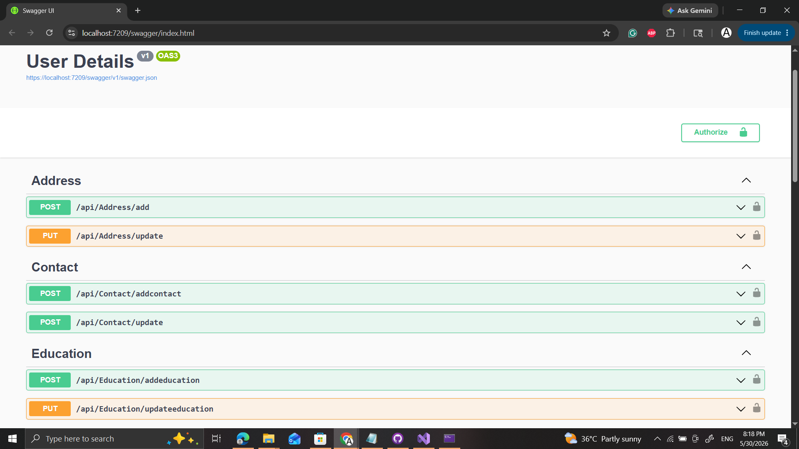
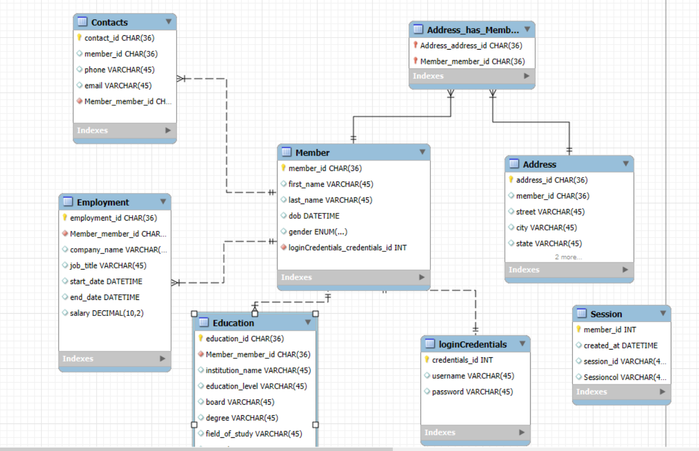

# User Management API

A RESTful ASP.NET Core Web API built using .NET 8 for user registration, authentication, and profile management.
## Documentation

Detailed project documentation is available here:

[Process Flow Documentation](Documentation/Process%20Flow%20Documentation.pdf)
## Overview

This project demonstrates the implementation of a scalable Web API using a layered architecture with proper separation of concerns. The application allows users to register, log in, and manage their profile information.

The project follows industry-standard design patterns such as Repository Pattern, Service Layer Pattern, Dependency Injection, and Entity Framework Core.

---

## Features

* User Registration
* User Login Authentication
* Password Hashing
* Profile Management
* Repository Pattern
* Service Layer Architecture
* Entity Framework Core
* SQL Server Integration
* Swagger API Documentation
* Clean and Maintainable Code Structure

---

## Technology Stack

* ASP.NET Core 8
* C#
* Entity Framework Core
* SQL Server
* Swagger / OpenAPI
* Git & GitHub

---
## Screenshots


## Swagger UI



## Registration Endpoint



## Database Structure

### Users

* UserId
* FirstName
* LastName
* Email
* PasswordHash
* DateOfBirth
* Gender
* CreatedOn
* UpdatedOn

### Contact

* ContactId
* UserId
* PhoneNumber
* AlternateNumber

### Address

* AddressId
* UserId
* Street
* City
* State
* Country
* PostalCode

### Education

* EducationId
* UserId
* Degree
* Institution
* YearOfCompletion

### Employment

* EmploymentId
* UserId
* CompanyName
* Position
* YearsOfExperience

---

## Project Structure

```text
Controllers/
DTO/
Helpers/

Repository/
 ├── Interfaces/
 └── Implementations/

Services/
 ├── Interfaces/
 └── Implementations/

Models/

Program.cs
```

---

## API Endpoints

### User

| Method | Endpoint               | Description         |
| ------ | ---------------------- | ------------------- |
| POST   | /api/users/register    | Register a new user |
| POST   | /api/users/login       | Login user          |
| PUT    | /api/users/update/{id} | Update user profile |
| GET    | /api/users/{id}        | Get user details    |

---

## Design Principles Used

* Separation of Concerns
* Repository Pattern
* Service Layer Pattern
* Dependency Injection
* Clean Architecture Concepts

---

## Future Improvements

* JWT Authentication
* Refresh Tokens
* Role-Based Authorization
* Email Verification
* Password Reset
* Unit Testing
* Docker Support
* Global Exception Handling
* Logging with Serilog

---

## Learning Outcomes

Through this project I gained hands-on experience with:

* ASP.NET Core Web API Development
* Entity Framework Core
* Database First Approach using Scaffold-DbContext
* API Design
* Repository and Service Patterns
* Git and GitHub Version Control
* Swagger Documentation

---

## Author

Anurag Kujur

Software Engineer | .NET Developer
